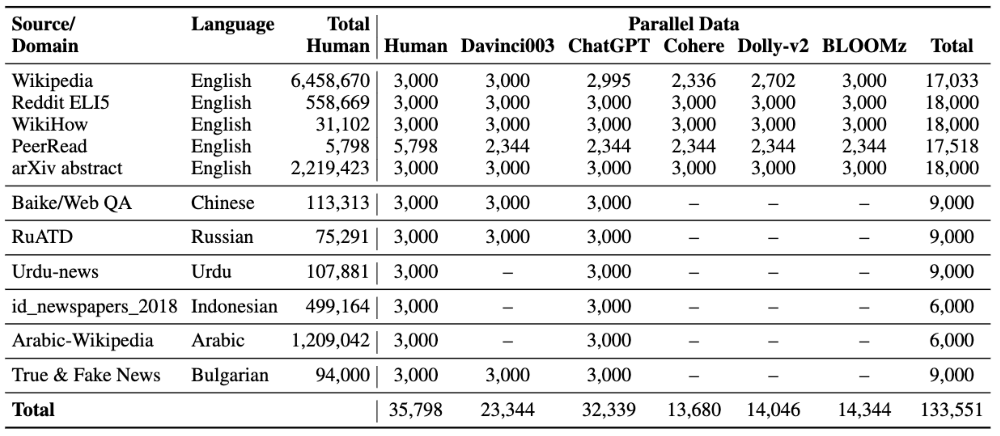

# SemEval-2024 Task 8: Multigenerator, Multidomain, and Multilingual Black-Box Machine-Generated Text Detection

[](https://raw.githubusercontent.com/mbzuai-nlp/SemEval2024-task8/subtask_A_and_B/LICENSE)

<p align="left" float="left">
  
</p>


[News](#news) | [Competition](#competition) | [Subtasks](#subtasks) | [Data Source](#data_source) | [Data Format](#data_format) | [Evaluation Metrics](#scorer_and_official_evaluation_metrics) | [Baselines](#baselines) | [FAQ](#faq) | [Organizers](#organizers) | [Contacts](#contacts)

Large language models (LLMs) are becoming mainstream and easily accessible, ushering in an explosion of machine-generated content over various channels, such as news, social media, question-answering forums, educational, and even academic contexts. Recent LLMs, such as ChatGPT and GPT-4, generate remarkably fluent responses to a wide variety of user queries. The articulate nature of such generated texts makes LLMs attractive for replacing human labor in many scenarios. However, this has also resulted in concerns regarding their potential misuse, such as spreading misinformation and causing disruptions in the education system. Since humans perform only slightly better than chance when classifying machine-generated vs. human-written text, there is a need to develop automatic systems to identify machine-generated text with the goal of mitigating its potential misuse. 

We offer three subtasks over two paradigms of text generation: (1) **full text** when a considered text is entirely written by a human or generated by a machine; and (2) **mixed text** when a machine-generated text is refined by a human or a human-written text paraphrased by a machine.

## NEWS 

### 22 April 2024
Check the SemEval Shared Task [Paper](https://github.com/mbzuai-nlp/SemEval2024-task8/blob/main/SemEval2024_task8_overview_April.pdf). To appear in NAACL SemEval-2024 soon!

### 3 Feb 2024
The results of the test phase are published!

Test results: https://docs.google.com/spreadsheets/d/1BWSb-vcEZHqKmycOHdrEvOiORpN93SqC5KiYILbKxk4/edit?usp=sharing

Test gold labels: https://drive.google.com/drive/folders/13aFJK4UyY3Gxg_2ceEAWfJvzopB1vkPc?usp=sharing

### 13 Jan 2024
Dear all participants, we apologize that there were something wrong with our CodaBench platform during **10-13 Jan**. We fixed it today and restart the competition. 
You can submit your solutions and then we will **announce** the final test results and rank until **the end of evaluation** (31 Jan).

PS: For submissions during 10-13 Jan, sorry we are only allowed to save all your score results but no permission to save all your submissions. 
In case of some mistakes, you can resubmit your running results.


### Test Sets are Ready, Go!
The SemEval-2024 Task 8 test sets are now available!
We have prepared machine-generated and human-written texts in English, Arabic, German, and Italian.

Access our test sets by [Google drive link](https://drive.google.com/drive/folders/10DKtClzkwIIAatzHBWXZXuQNID-DNGSG?usp=sharing).

Submit your solution by **31 January 2024** using the CodaBench platform!

## Competition

Our competition is launched on the CodaBench platform: [https://www.codabench.org/competitions/1752](https://www.codabench.org/competitions/1752).

## Subtasks

- **Subtask A. Binary Human-Written vs. Machine-Generated Text Classification:** Given a full text, determine whether it is human-written or machine-generated. There are two tracks for subtask A: monolingual (only English sources) and multilingual.

- **Subtask B. Multi-Way Machine-Generated Text Classification:** Given a full text, determine who generated it. It can be human-written or generated by a specific language model.

- **Subtask C. Human-Machine Mixed Text Detection:** Given a mixed text, where the first part is human-written and the second part is machine-generated, determine the boundary, where the change occurs.

## Data Restriction
Note that additional training data is **NOT allowed** for all participants.

## <a name="data_source"></a>Data Source
The data for the task is an extension of the M4 dataset. Here are current statistics about the dataset.

<p align="center" width="80%">
    <a></a>
</p>

## Citation
The M4 dataset is described in an [EACL'2024 paper -- Best Resource Paper Award](https://aclanthology.org/2024.eacl-long.83/):
```bibtex
@inproceedings{wang-etal-2024-m4,
    title = "M4: Multi-generator, Multi-domain, and Multi-lingual Black-Box Machine-Generated Text Detection",
    author = "Wang, Yuxia  and
      Mansurov, Jonibek  and
      Ivanov, Petar  and
      Su, Jinyan  and
      Shelmanov, Artem  and
      Tsvigun, Akim  and
      Whitehouse, Chenxi  and
      Mohammed Afzal, Osama  and
      Mahmoud, Tarek  and
      Sasaki, Toru  and
      Arnold, Thomas  and
      Aji, Alham  and
      Habash, Nizar  and
      Gurevych, Iryna  and
      Nakov, Preslav",
    editor = "Graham, Yvette  and
      Purver, Matthew",
    booktitle = "Proceedings of the 18th Conference of the European Chapter of the Association for Computational Linguistics (Volume 1: Long Papers)",
    month = mar,
    year = "2024",
    address = "St. Julian{'}s, Malta",
    publisher = "Association for Computational Linguistics",
    url = "https://aclanthology.org/2024.eacl-long.83",
    pages = "1369--1407",
    abstract = "Large language models (LLMs) have demonstrated remarkable capability to generate fluent responses to a wide variety of user queries. However, this has also raised concerns about the potential misuse of such texts in journalism, education, and academia. In this study, we strive to create automated systems that can detect machine-generated texts and pinpoint potential misuse. We first introduce a large-scale benchmark M4, which is a multi-generator, multi-domain, and multi-lingual corpus for machine-generated text detection. Through an extensive empirical study of this dataset, we show that it is challenging for detectors to generalize well on instances from unseen domains or LLMs. In such cases, detectors tend to misclassify machine-generated text as human-written. These results show that the problem is far from solved and that there is a lot of room for improvement. We believe that our dataset will enable future research towards more robust approaches to this pressing societal problem. The dataset is available at https://github.com/mbzuai-nlp/M4",
}
```

The SemEval-2024 Task 8 bibtex is below:
```bibtex
@inproceedings{semeval2024task8,
  author    = {Wang, Yuxia  and  Mansurov, Jonibek  and  Ivanov, Petar  and  su, jinyan  and  Shelmanov, Artem  and  Tsvigun, Akim  and  Mohammed Afzal, Osama  and  Mahmoud, Tarek  and  Puccetti, Giovanni  and  Arnold, Thomas  and  Whitehouse, Chenxi  and  Aji, Alham Fikri  and  Habash, Nizar  and  Gurevych, Iryna  and  Nakov, Preslav},
  title     = {SemEval-2024 Task 8: Multidomain, Multimodel and Multilingual Machine-Generated Text Detection},
  booktitle      = {Proceedings of the 18th International Workshop on Semantic Evaluation (SemEval-2024)},
  month          = {June},
  year           = {2024},
  address        = {Mexico City, Mexico},
  publisher      = {Association for Computational Linguistics},
  pages     = {2041--2063},
  abstract  = {We present the results and the main findings of SemEval-2024 Task 8: Multigenerator, Multidomain, and Multilingual Machine-Generated Text Detection. The task featured three subtasks. Subtask A is a binary classification task determining whether a text is written by a human or generated by a machine. This subtask has two tracks: a monolingual track focused solely on English texts and a multilingual track. Subtask B is to detect the exact source of a text, discerning whether it is written by a human or generated by a specific LLM. Subtask C aims to identify the changing point within a text, at which the authorship transitions from human to machine. The task attracted a large number of participants: subtask A monolingual (126), subtask A multilingual (59), subtask B (70), and subtask C (30). In this paper, we present the task, analyze the results, and discuss the system submissions and the methods they used. For all subtasks, the best systems used LLMs.},
  url       = {https://aclanthology.org/2024.semeval2024-1.275}
}
```

## <a name="data_format"></a>Data Format
### Data Download Instructions

To download the dataset for this project, follow these steps:

1. Install the `gdown` package using pip:

```
pip install gdown
````

2. Use `gdown` to download the dataset folders by providing the respective file IDs for each subtask:

| Task          | Google Drive Folder Link                                                                                           | File ID                                        |
|---------------|--------------------------------------------------------------------------------------------------------------------|------------------------------------------------|
| Whole dataset | [Google Drive Folder](https://drive.google.com/drive/folders/14DulzxuH5TDhXtviRVXsH5e2JTY2POLi)            | 14DulzxuH5TDhXtviRVXsH5e2JTY2POLi            |
| Subtask A     | [Google Drive Folder](https://drive.google.com/drive/folders/1CAbb3DjrOPBNm0ozVBfhvrEh9P9rAppc)            | 1CAbb3DjrOPBNm0ozVBfhvrEh9P9rAppc            |
| Subtask B     | [Google Drive Folder](https://drive.google.com/drive/folders/11YeloR2eTXcTzdwI04Z-M2QVvIeQAU6-)            | 11YeloR2eTXcTzdwI04Z-M2QVvIeQAU6-            |
| Subtask C     | [Google Drive Folder](https://drive.google.com/drive/folders/16bRUuoeb_LxnCkcKM-ed6X6K5t_1C6mL)            | 16bRUuoeb_LxnCkcKM-ed6X6K5t_1C6mL            |

```
gdown --folder https://drive.google.com/drive/folders/<file_id>
```
Make sure to replace `<file_id>` with the respective file IDs provided above when running the `gdown` command for the desired dataset.

3. After downloading place the files in their respective subtask folder.


The datasets are JSONL files.
The data is located in the following folders:
* **Subtask A:**
  * Monolingual track:
    * subtaskA/data/subtaskA_train_monolingual.jsonl
    * subtaskA/data/subtaskA_dev_monolingual.jsonl
  * Multilingual track:
    * subtaskA/data/subtaskA_train_multilingual.jsonl
    * subtaskA/data/subtaskA_dev_multilingual.jsonl
* **Subtask B:**
  * subtaskB/data/subtaskB_train.jsonl
  * subtaskB/data/subtaskB_dev.jsonl
* **Subtask C:**
  * subtaskC/data/subtaskC_train.jsonl
  * subtaskC/data/subtaskC_dev.jsonl


### Statistics
| Subtask                     |  #Train |   #Dev  |
|:----------------------------|--------:|--------:|
| Subtask A (monolingual)     | 119,757 |   5,000 |
| Subtask A (multilingual)    | 172,417 |   4,000 |
| Subtask B                   |  71,027 |   3,000 |
| Subtask C                   |   3,649 |     505 | 


### Input Data Format

#### Subtask A:
An object in the JSON format:
```
{
  id -> identifier of the example,
  label -> label (human text: 0, machine text: 1,),
  text -> text generated by a machine or written by a human,
  model -> model that generated the data,
  source -> source (Wikipedia, Wikihow, Peerread, Reddit, Arxiv)  on English or language (Arabic, Russian, Chinese, Indonesian, Urdu, Bulgarian, German)
}
```

#### Subtask B:
An object of the JSON has the following format:
```
{
  id -> identifier of the example,
  label -> label (human: 0, chatGPT: 1, cohere: 2, davinci: 3, bloomz: 4, dolly: 5),
  text -> text generated by machine or written by human,
  model -> model name that generated data,
  source -> source (Wikipedia, Wikihow, Peerread, Reddit, Arxiv) on English
}
```


#### Subtask C:
An object of the JSON has the following format:
```
{
  id -> identifier of the example,
  label -> label (index of the word split by whitespace where change happens),
  text -> text generated by machine or written by human,
}
``` 

### Prediction File Format and Format Checkers

A prediction file must be one single JSONL file for all texts. The entry for each text must include the fields "id" and "label".  

The format checkers verify that your prediction file complies with the expected format. They are located in the ```format_checker``` module in each subtask directory.

#### Subtask A:
```python
python3 subtaskA/format_checker/format_checker.py --pred_files_path=<path_to_your_results_files> 
```

#### Subtask B:
```python
python3 subtaskB/format_checker/format_checker.py --pred_files_path=<path_to_your_results_files> 
```

### Subtask C:
To launch it, please run the following command:
```python
python3 subtaskC/format_checker/format_checker.py --pred_files_path=<path_to_your_results_files> 
```

Note that format checkers can not verify whether the prediction file you submit contains predictions for all test instances because it does not have an access to the test file.

## <a name="scorer_and_official_evaluation_metrics"></a>Scorer and Official Evaluation Metrics

The scorers for the subtasks are located in the ```scorer``` modules in each subtask directory.
The scorer will report the official evaluation metric and other metrics for a given prediction file.

### Subtask A:
The **official evaluation metric** for the Subtask A is **accuracy**. However, the scorer also reports macro-F1 and micro-F1. 

The scorer is run by the following command:
```python
python3 subtaskA/scorer/scorer.py --gold_file_path=<path_to_gold_labels> --pred_file_path=<path_to_your_results_file> 
```

### Subtask B:
The **official evaluation metric** for the Subtask B is **accuracy**. However, the scorer also reports macro-F1 and micro-F1. 

The scorer is run by the following command:
```python
python3 subtaskB/scorer/scorer.py --gold_file_path=<path_to_gold_labels> --pred_file_path=<path_to_your_results_file> 
```

### Subtask C:
The **official evaluation metric** for Subtask C is the **Mean Absolute Error (MAE)**. This metric measures the absolute distance between the predicted word and the actual word where the switch between human and machine occurs.
To launch it, please run the following command:
```python
python3 subtaskC/scorer/scorer.py --gold_file_path=<path_to_gold_labels> --pred_file_path=<path_to_your_results_file> 
```

## <a name="baselines"></a>Baselines

### Task A

Running the Transformer baseline:
 ```
python3 subtaskA/baseline/transformer_baseline.py --train_file_path <path_to_train_file> --test_file_path <path_to_test_file> --prediction_file_path <path_to_save_predictions> --subtask A --model <path_to_model>
 ```

The average results for the monolingual setup across three runs for RoBERTa is 0.74;

The average results for the multilingual setup across three runs for XLM-R is 0.72;

### Task B

Running the Transformer baseline:
 ```
python3 subtaskB/baseline/transformer_baseline.py --train_file_path <path_to_train_file> --test_file_path <path_to_test_file> --prediction_file_path <path_to_save_predictions> --subtask B --model <path_to_model>
 ```
The average results across three runs for RoBERTa is 0.75;

### Task C

Running the Transformer baseline
 ```
bash subtaskC/baseline/run.sh
 ```
The average MAE score across three runs for longformer is: 3.53 ± 0.212

To modify the hyperparameters, please edit the corresponding python command within the run.sh file.

## <a name="faq"></a> FAQ
#### Q: How many times can we submit? Which submission will be used for the final ranking?
**A:** We do not limit your submission times. The **final (last) submission** will be used for the final rank.

#### Q: For subtask C, how did we define the gold boundary?
**A:** Simply speaking, given a text: human_text_segment + machine_generated_text, the boundary label = len(human_text_segment.split(" ")).
**Note that using split(" ") with whitespace as the argument, rather than split()**

#### Q: Where should we register for this shared task?
**A:** In our competition on CodaBench: [https://www.codabench.org/competitions/1752](https://www.codabench.org/competitions/1752).

#### Q: Should we do all subtasks or just one of them?
**A:** You can choose any tasks in which you are interested. Also, if you just want to do English track, it is also allowed, or if you just want to do multilingual track, it is welcomed.

#### Q: Are all of the deadlines alligned with the dates posted here? https://semeval.github.io/SemEval2024/
**A:** Yes, so far all deadlines are aligned with the https://semeval.github.io/SemEval2024/ , we will make announcement if there are any changes.


#### Q: Could you please tell me what the differences are between our task’s dataset and the M4 dataset? Are they absolutely the same?

**A:** There are mainly three major differences compared to the M4 dataset: 1) task formulation is different, 2) we upsampled human text for data balance; and 3) new and surprising domains, generators and languages will appear in test sets (real test set will not include information about generators, domains and languages).

#### Q: We noticed significant disproportionality between training and development sets. For example Subtask A related to machine-generated texts: the training set does not contain BLOOMz outputs, while the development set contains only them. Could you please clarify the reason for such an intriguing splitting?

**A:** We split in this way because it is more aligned with the real application scenarios where many domains and generators are unseen during training. Besides, such a development set also serves as a hint to participants that totally new domains, generators and languages will be included in the real test sets (real test set will not include information about generators, domains and languages).

#### Q: Whether it is allowed to use additional data?

**A:** It is not allowed to use extra data.

## Organizers

- Yuxia Wang, Mohamed bin Zayed University of Artificial Intelligence
- Alham Fikri Aji, Mohamed bin Zayed University of Artificial Intelligence
- Artem Shelmanov, Mohamed bin Zayed University of Artificial Intelligence
- Akim Tsvigun, Semrush
- Giovanni Puccetti, Institute of Information Science and Technology, A. Faedo (ISTI CNR)
- Chenxi Whitehouse, Mohamed bin Zayed University of Artificial Intelligence
- Petar Ivanov, Sofia University
- Jonibek Mansurov, Mohamed bin Zayed University of Artificial Intelligence
- Jinyan Su, Mohamed bin Zayed University of Artificial Intelligence
- Tarek Mahmoud, Mohamed bin Zayed University of Artificial Intelligence
- Osama Mohammed Afzal, Mohamed bin Zayed University of Artificial Intelligence
- Thomas Arnold, Technical University Darmstadt
- Iryna Gurevych, Mohamed bin Zayed University of Artificial Intelligence
- Nizar Habash, Mohamed bin Zayed University of Artificial Intelligence
- Preslav Nakov, Mohamed bin Zayed University of Artificial Intelligence

## Contacts

Google group: [https://groups.google.com/g/semeval2024-task8/](https://groups.google.com/g/semeval2024-task8/)  
Email: semeval2024-task8@googlegroups.com
